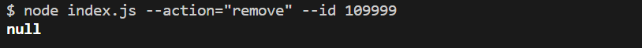

# Отримуємо і виводимо весь список контактів у вигляді таблиці (console.table)

node index.js --action="list"

# Отримуємо контакт по id і виводимо у консоль об'єкт контакту або null, якщо контакту з таким id не існує.

node index.js --action="get" --id 1

# Додаємо контакт та виводимо в консоль об'єкт новоствореного контакту

node index.js --action="add" --name Mango --email mango@gmail.com --phone 322-22-22

# Видаляємо контакт та виводимо в консоль об'єкт видаленого контакту або null, якщо контакту з таким id не існує.

node index.js --action="remove" --id 1

